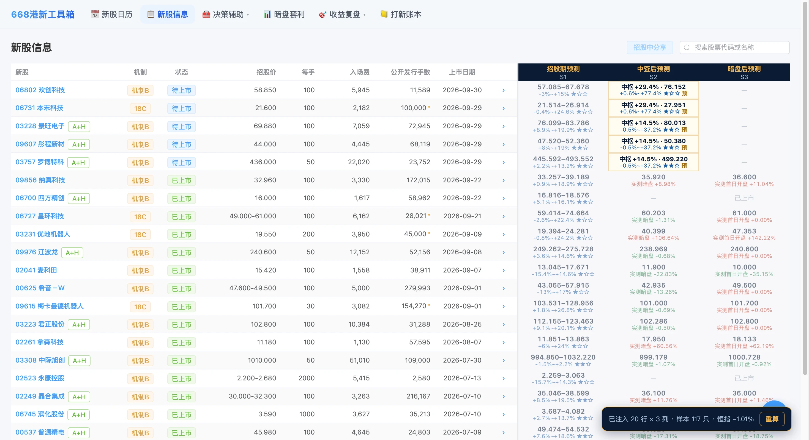
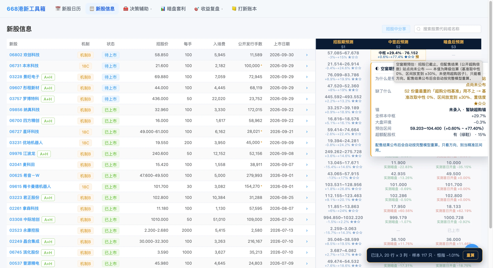
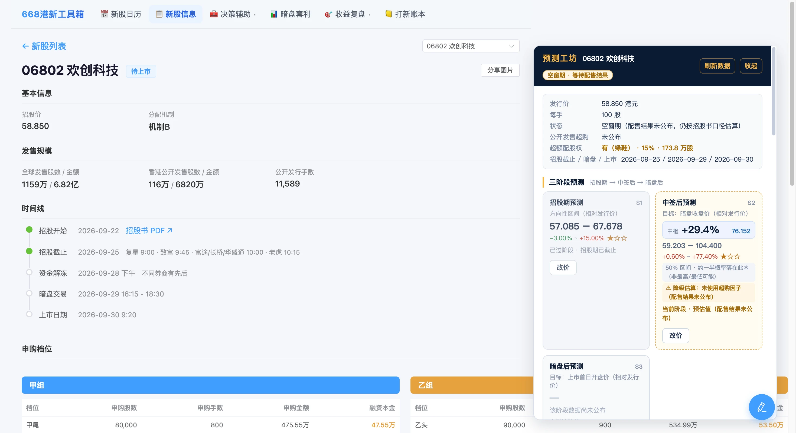
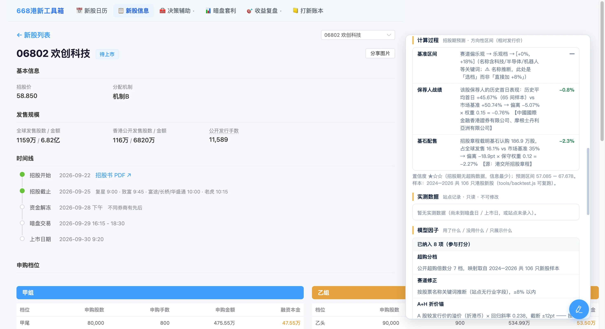

# 港股打新预测 · i668 增强（浏览器插件）

> **一句话**：拿过去 117 只港股新股的真实表现当「老师」，反推一只新股上市后（暗盘 / 首日）大概能涨多少，并**老实标出这个预测有多不靠谱**——区间窄 = 有把握，区间宽 = 这只在历史样本里本来就没规律。

在 [i668 港新工具箱](https://www.i668.vip) 的两处做增强，**不改动站点任何原有结构**。

## 安装（离线加载，免费）

1. 打开 Chrome / Edge 的扩展管理页（`chrome://extensions` 或 `edge://extensions`），开启「开发者模式」。
2. 点「加载已解压的扩展程序」，选择本仓库目录（`i668-ipo-predict/`）。
3. 访问 https://www.i668.vip/stocks ，右下角出现浮条即生效。

> 改过代码须在扩展管理页点「重新加载」；**改过 `manifest.json` 必须重新加载**（浏览器只在启动时读一次清单）。

## 怎么用

### 列表页 `/stocks`
- 表格**最右追加三列**预测：招股期（S1）/ 中签后（S2）/ 暗盘后（S3），随阶段与大盘实时更新，**一屏全见**，站点原有列序 / 列宽 / 行高不动。
- 列状态：未到阶段显「—」；已过阶段灰显保留；当前阶段琥珀金描边高亮；数据未公布显「待公布」。
- 悬浮任一预测格：弹出摘要卡（锚 / 关键因子 / 区间 / 置信度 / 模型未纳入项）；点任一格进详情页。

### 详情页 `/stocks/<代码>`：「预测工坊」
页面顶部插入工坊卡片，五个区块：

| 区块 | 内容 |
|---|---|
| 三阶段预测 | 三张卡：模型区间 + 涨跌幅 + 置信度星级 + 状态（当前 / 已过 / 未到 / 已出实测）；每张卡可「改价」 |
| 计算过程 | 当前阶段的**逐项增量表**，每步写明理由，末尾给出「修正后基准」与「展开区间」 |
| 实测数据 | 暗盘收盘 / 首日收盘（**只读**，标注站点口径） |
| 复盘 | 你设过且已有实测时，给出「你的设定 vs 实际」与高估/低估点数 |
| 模型因子 | 三段：已纳入 8 项 + 只展示 3 项 + 未纳入 2 项及原因 |

**改价**：点任一阶段卡「改价」→ 填区间（下沿/上沿，可填 `25.5` 或 `+50%`）→ 可加备注 → 保存，即刻变为「✎ 人工设定」，并提供「恢复模型值」。

### 界面截图

列表页：一屏看尽三阶段预测


鼠标移到「招股期预测」列头，弹出该因子的口径说明（数据来源 / 标定依据 / 命中率）。


详情页「预测工坊」：三阶段预测 + 计算过程


「计算过程」逐层摊开 + 因子模型清单（已纳入 / 只展示 / 拿不到）。


### Popup 设置（点扩展图标）
- A→H 汇率（CNY→HKD，默认 1.09）
- 启用实时大盘行情（恒指 + A 股比价，默认开）
- **模拟日期**：填某日可预览该日三列行为与置灰效果，留空 = 今天

## 预测原理（简要）

模型用 **2024–2026 共 117 只真实港股新股**当训练样本，按**条件分位法**给每只新股一个带置信区间的预测：

- **中枢** = 该条件集（超购档位 / A+H 折价档 / 全样本兜底）的**中位数**；
- **区间** = 该条件集的 **[P25, P75]** 不对称分位（真实的 50% 中央区间，标称覆盖率）；
- **三阶段**：S1（招股期，无超购给方向性宽区间）、S2（中签后，核心预测）、S3（暗盘后，以暗盘为锚复盘）。阶段按**时间相位**判定，自动随打开日期刷新。
- **因子三态**：8 个已纳入打分 / 3 个只展示不入权重（绿鞋、发售结构、散户中签率）/ 2 个免费源拿不到（国配明细、未上市开盘价）。每个权重都做过实测消融，没有拍脑袋。

实测精度：**S2 区间名义 50% 实际命中 48.2%**，点估计误差中位 24.9pt，残差中位 +0.3pt（无系统性偏差）。**区间越宽 = 这只真的没把握**，如实告知，比假装精确有用。

> 完整的数据源表、逐步手算、因子全表、消融实验与复现流程，见 [TECHNICAL.md 技术白皮书](TECHNICAL.md)。

## 数据来源与隐私

- **纯前端、免费、离线加载**；运行时只向 i668 接口与腾讯行情取数（均为公开免费源），**不向任何第三方上传你的数据**。
- **免费因子库**（保荐人战绩 / 首日开盘价 / 基石配售 / 绿鞋）由随插件加载的本地文件 `data/extras.js` 提供——构建期从 etnet 公开页与港交所招股章程抓取烤入，**插件运行时不请求这些站点**。
- **改价数据只存在本机** `chrome.storage.local`，不联网。

## 注意事项（踩过的坑，简要）

- **预测是统计推断，不是荐股、不保收益**——它是概率区间，不是承诺。
- **必须配合 i668 港新工具箱使用**：本插件是「增强」它的页面，不是独立站点。
- **免费源仍有两类拿不到**：国配明细（认购人结构，付费数据商内容）与未上市股的开盘价（尚未发生）。模型按中性处理，**用「改价」把你掌握的信息补进去**。
- **站点前端改版可能导致匹配失效**：列表侧浮条会如实报「未匹配到新股表格」，工坊侧显示「未能取得该股数据」，渲染异常逐格降级，不静默、不拖垮整表。

## 想深入了解？看技术白皮书

### 👉 [TECHNICAL.md —— 完全技术白皮书](TECHNICAL.md)

写给**完全不懂代码的小白**和**第一次接触本项目的 Agent**，目标只有一个：**看完就能复刻**。

| 章节 | 你能拿到什么 |
|---|---|
| [第 4 章](TECHNICAL.md#4) | 数据源全表：5 个数据源（含 API 签名、腾讯 GBK 坑） |
| [第 5 章](TECHNICAL.md#5) | 阶段系统：S1/S2/S3、数据阶段 vs 时间相位、空窗期 |
| [第 6 章](TECHNICAL.md#6) | 逐步手算：S1/S2/S3 完整公式 |
| [第 7 章](TECHNICAL.md#7) | 因子全表：8 纳入 / 3 展示 / 2 缺失 |
| [第 8 章](TECHNICAL.md#8) | 为什么 6 个因子被砍掉（n=106 消融实测） |
| [第 10 章](TECHNICAL.md#10) | 复现全流程 + 10 个必踩的坑 |

> 白皮书里所有数字都能用 `tools/verify-calc.js` 复验（当前基线：117 只 / 344 阶段 / **0 错误**，S2 区间实测命中 **48.2%**）。

## 目录结构

```
i668-ipo-predict/
├── manifest.json             # MV3 清单
├── data/extras.js            # 免费因子库（抓取脚本生成，勿手改）
├── content/                  # core.js / list.js / detail.js / boot.js / styles.css
├── popup/                    # 设置页
├── tools/                    # backtest.js / fetch-etnet.py / fetch-prospectus.py / make-icons.py
├── screenshots/              # README 用界面截图
└── README.md
```

## 版本历史

| 版本 | 要点 |
|---|---|
| **0.4.0** | 可解释模型 + 详情页「预测工坊」+ 手动改价 + 复盘 + 悬浮摘要卡 |
| 0.3.0 | 放开站点宽度锁实现一屏全见（先锁后放） |
| 0.2.3 | 实测优先（暗盘/首日实测不再给预测） |
| 0.2.2 | 插件图标；滚动条加粗常显 |
| 0.2.1 | 三列改追加到最右；行高 32→33px |
| 0.2.0 | el-table 适配；真实状态反馈 |
